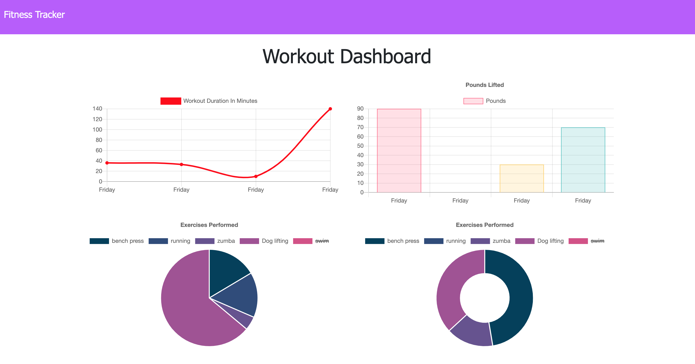

# excercise-tracking
An Excerise Tracker application that is built using MongoDB. The application allows a user to track their workout routine by adding exercise types, resistance or cardio, followed by data for each including sets, reps, distance, etc. The user can add multiple exercises to one workout, and their statistics will be generated showing the total duration, total reps, total sets. Data for the last 7 workouts will also be displayed which provide another visual representation in addition to their physique to track progress over time.





## Heroku-Deployed

[Deployed Link]()  

# Table of Contents 

| |||
|:-:|:-:|:-:|
|[Project Introduction](#excercise-tracking) | [Table of Contents](#table-of-contents) | [Heroku](#heroku-deployed) |  [Description of Page Building](#Description-of-Page-Building)| [Code Snippets](#code-snippet) 
| [Technologies Used](#Technologies-Used) |  [Author](#author) | [License](#License)

---


## Description of Page Building 
* In server.js
   <ul> 
  <li> Requiring necessary npm packages
  <li> Setting up port and requiring models for syncing
  <li> Creating express app and configuring middleware needed for authentication
  <li> Requiring our routes
  <li> Listen to port to activate the server 
  </li>
  </ul>

* In public folder
  <ul> 
  <li> A css style with images and styling
  <li> Interface files such as exercise.html file and index.html and stats.
  <li> Clientside javascript files where it will listen to the clients request and send it to the back-end as well as poppulate chart 
  </li>
   </ul>


* In routes folder to handle when the user "visit" the page
  <ul> 
  <li> Html routes that serve up the html page when client calls
  <li> API routes to serve up JSON object use to populate the page 
  </li>
  </ul>
* In models folder
  <ul> 
  <li> excercise.js file uses mongoose to create table that content date, excercise array of type, name, duration, weight, reps, and sets
  <li> module.export Schema 
  </li> 
  </ul>


## Code Snippet
Install npm package 
npm install express mongoose morgan 

Required variables 
``` Javascript
const express = require("express");
const logger = require("morgan");
const mongoose = require("mongoose");
```

Sets up the Express app to handle data parsing
``` Javascript
const app = express();

app.use(logger("dev"));

app.use(express.urlencoded({ extended: true }));
app.use(express.json());

app.use(express.static("public"));
```

Set routes to handle when user "visit" the page 
``` Javascript
require("./routes/html-routes.js")(app);
app.use(require("./routes/api-routes.js"));
```


Use MongoDB aggregate function to dynamically add up and return the total duration for each workout
``` Javascript 
router.get("/api/workouts", (req,res)=>{
  db.aggregate( [
    { $addFields: {
        totalDuration: { $sum: "$exercises.duration" } 
      }
    }
 ] ).then(dbWorkouts =>{
      res.json(dbWorkouts)
    })
    .catch(err =>{
      res.json(err);
    });
  });
```


do this because 
``` Javascript 
const mongoose = require("mongoose");

const Schema = mongoose.Schema;

const UserWorkout = new Schema ({
    day: {type:Date,
    default:Date.now 
  },

  exercises:[{
    type:{type: String,trim: true,require: "type is required" },
    name: {type: String,trim: true,require: "name of excercise is required" ,
    duration: {type: Number },
    weight: {type: Number},
    reps: {type: Number},
    sets:{type:Number }, 
    distance: {type: Number}
  }],
  totalWorkoutDuration: {
    type:Number 
  }
});

const Workouts = mongoose.model("Workouts", UserWorkout);
// workouts is my "table name"
// USerworkout is my value of that schema

module.exports = Workouts;
```
## Technologies Used

||||||
|:-:|:-:|:-:|:-:|:-:|
|[HTML](https://developer.mozilla.org/en-US/docs/Web/HTML) | [CSS](https://developer.mozilla.org/en-US/docs/Web/CSS) | [Heroku](https://heroku.com/) | [Javascript](https://developer.mozilla.org/en-US/docs/Web/JavaScript) |[Node.js](https://nodejs.org/en/) 

||||||
|:-:|:-:|:-:|:-:|:-:|
|[Express](https://expressjs.com/)| [GitHub](https://github.com/) | [Mongoose](https://mongoosejs.com/docs/defaults.html) | [Morgan](https://www.npmjs.com/package/morgan)


<br>

## Author

| | |
| --- | --- |
|**B Tram Vu**|[ LinkedIn](https://www.linkedin.com/in/b-tram-vu/) [ GitHub](https://github.com/vubao2303) | [ Portfolio](https://www.linkedin.com/in/b-tram-vu-866250121/)


---

## License

[](https://opensource.org/licenses/MIT)
